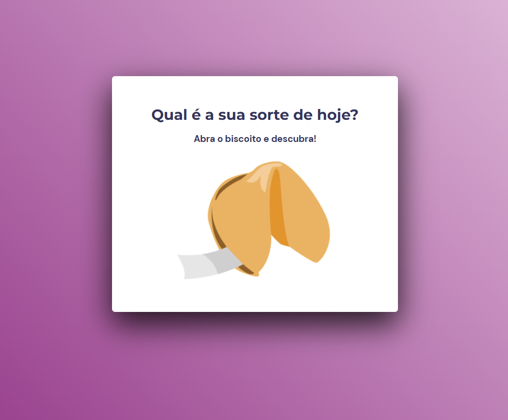

<h1 align="center">Biscoito da Sorte</h1>

  

 

  

 

## 🚀 Tecnologias

Esse projeto foi desenvolvido com as seguintes tecnologias:

- HTML 
- CSS
- JavaScript

 

## 💻 Projeto

- [Visite o projeto online]()
 

## 🔖 Layout

Você pode visualizar o layout do projeto através [DESSE LINK](https://www.figma.com/file/fX7p88MIXArG7lSbUX6UQF/Biscoito-da-Sorte-(Community)?t=Wnh4mEeiWLuBebqK-0). É necessário ter conta no [Figma](https://figma.com) para acessá-lo.

## :memo: Licença

Esse projeto está sob a licença MIT.

---

Projeto feito através do Programa Explorer da Rocketseat ♥